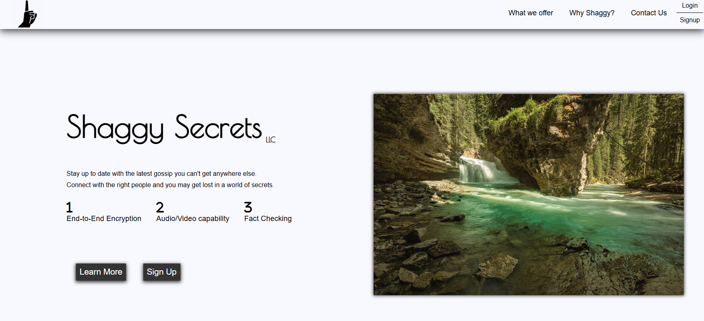
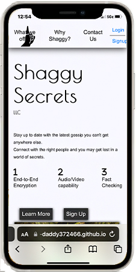
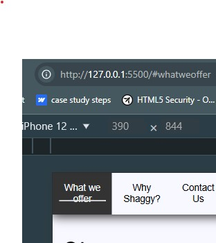
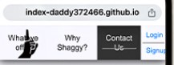

# Case Study: Shaggy Secrets


## Description

- Stay up to date with the latest gossip that you cannot get anywhere else.
Connect with the right people and you may get lost in a world of secrets.

### Issues:

1. #### _Overlapped Elements_ <br>



**Description**: <br> Notice how the navigation is reduced in size compared to the desktop view above. The first navigation link, "What we Offer" seems to overlap the logo. Just like our navigation list-items, the logo is covered by an article tag that ulitmately refreshes the page.

```
    <div id="logo-container">
        <a href="/">
          
        </a>
    </div>
```

After testing, the navigation-item, "What we offer" is clicked on, as this seems to be on a greater index than the logo image.
After modifying the navigation link's href to _#whatweoffer_, we can see that this link has been clicked.



If the client intends to click on the logo, then the logo's z-index would need to be higher that the navigation item that overlaps. In result, _What we Offer_ will be inaccessible. 


2. #### _Touch event: element remains in hovered state_ <br>
3. #### _When scrolling down, access the navigation items_ is limited. <br>

**Description**: <br>Whether the target link is directed to a __Blank_ page or __self_, the item touched remains in it's hovered state. The underline-feature seems to be cutting through the navigation-item text.
When scrolling down, access to navigation pane is limited.


4. #### _Button-element text color is not consistent with the rest of the page._ <br>

**Description**: <br> Buttons _Login_ & _Signup_ default to light blue. Element consistency and uniformity is weakened. 


_____

### Solutions:

<hr id="solution1" style="opacity:0;">

1. _Overlapped Elements_

In response to overlapping elements, the current ```nav#nav``` element is transformed into a compact,div element & is viewed when user toggles the hamburger menu.

<div style="display:grid;grid-template-columns:1fr 1fr;width:100%;transform:scale(.88);">


</div>

3 ```span``` elements are combined to create the _Hamburger_ menu.
3 classes are made-up to represent how the span elements will end up after the container is clicked. (Hamburger menu).<br>
In addition, the Navigation menu's position is determined by classes, _hi-nav_ & _bye-nav_.
**_CSS_**
```
.bye-nav {
    right: -100%;
  }
  .hi-nav {
    right: 0;
  }
  .top-span {
    transform: translate(0, 13.5px) rotate(45deg);
  }
  .bottom-span {
    transform: translate(0, -15px) rotate(-45deg);
  }
  .mid-span {
    opacity: 0;
    transform: translate(0, -5px) rotate(360deg);
  }
```
Javascript captures an array of 3-classes and stores it into ```spanclasses``` variable. Next, a click event is set on the hamburger's container, _span-container_, where each span toggles it's class, or position, based on ```spanclasses``` variable index. Finally a toggleNav() function displays our mobile navigation pane or hides the element.<br>
**_JS_**
```
const spanclasses = ['top-span','mid-span','bottom-span']
const mobbtn = document.getElementById('span-container')
const spans = [...mobbtn.children]

// test click mob button
  mobbtn.onclick = e => {
      console.log('target acquired')
      spans.forEach((sp,idx)=>{
         sp.classList.toggle(spanclasses[idx])
      })
      toggleNav(document.getElementById('nav'))
  }
```
<div style="display:grid;grid-template-columns:1fr 1fr;width:100%;transform:scale(.88);">


</div>

<hr id="solution2" style="opacity:0;">

2. _Touch event: element remains in hovered state_

Hovered elements' styles are fixed to make it seem like the hovered element is disabled. We are setting a new :hover pseudo-class when the media query changes.<br>
Each links' transition is **unset** since there is no need to transition to a different background/text color.
Finally, **_:active pseudo-class_** is implemented to alert the user that a link has been clicked on.

**_CSS_**
```
.nav-list-item > a,
  #login,#signup{
    transition: unset;
  }
  .nav-list-item > a:hover,
  #login:hover,#signup:hover {
    color: #000;
    background: transparent;
  }
  .nav-list-item > a:active,
  #login:active,#signup:active {
    color: ghostwhite;
    background: #333;
    cursor: pointer;
  }
```

 

 The underline-feature seems to be cutting through the navigation-item text.<br>
 Javascript is used to create a condition **_[mobileWidth]_** that determines the devices' inner width. If the condition returns true, then the underline-feature is sacrificed because ```mouseenter``` & ```mouseleave``` events will not be triggered.<br>
**_JS_**
```
const mobileWidth = window.innerWidth <= 989;

if(!mobileWidth){
  item.addEventListener("mouseenter", hoverOverListItem);
  item.addEventListener("mouseleave", hoverLeaveListItem);
 }
```
<hr id="solution3" style="opacity:0;">

3. _When scrolling down, access the navigation items is limited_ <br>
Thanks to <a href="#solution1">solution 1</a> the ```nav#nav``` element's position is set to **fixed**.<br>
Since the navigation is transformed and hidden upon entering the page, ```<div id="mob-wrapper"></div>``` is created to _act_ as a container holding the logo & hamburger menu when it is really an empty div element in a fixed position. <br>
Now, when the user scrolls the page, their access to the navigation menu should remain visible.


**_HTML_**
```
<div id="mob-wrapper"></div>
          <!-- logo -->
        <div id="logo-container">
          <a href="/">
            
          </a>
        </div>
        <!-- hamburger menue -->
          <div id="span-container" class="nohighlight">
            <div class="mob-span no-pointer"></div>
            <div class="mob-span no-pointer"></div>
            <div class="mob-span no-pointer"></div>
          </div>
```
**_CSS_**
```
#mob-wrapper{
    border-bottom:2px solid black;
    height:67px;
    position:fixed;
    top:0;
    left:0;
    transition: .25s;
    width:100%;
    display:Block;
  }
  ```
  <div style="display:grid;grid-template-columns:1fr 1fr;width:100%;transform:scale(.88);">
  <div>
  <h4 style="text-align:center">Starting point</h4>
  
  </div>
  <div>
  <h4 style="text-align:center">Scrolled</h4>
  
  </div>
</div>